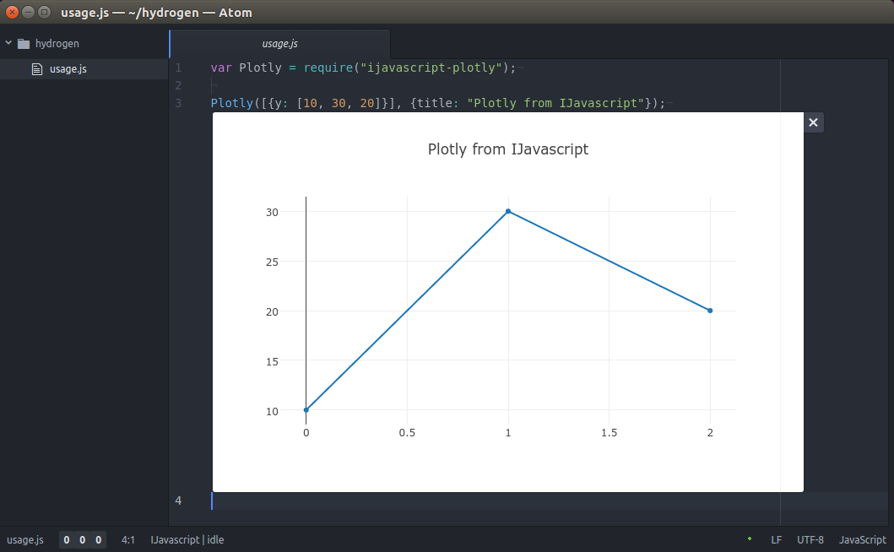

# IJavascript Wrapper for Plotly

`ijavascript-plotly` is an [npm module](https://www.npmjs.com/) for creating
[Plotly](https://plot.ly/) plots in IJavascript.

This is an alpha release (API is likely to change).


## Usage

```js
var Plotly = require("ijavascript-plotly");

Plotly([{y: [10, 30, 20]}], {title: "Plotly from IJavascript"});
```




## Compatible Frontends

| Frontend | Requirements |
| :-- | :-: |
| hydrogen@2.16.3 | none |
| nteract@0.28.0 | none |
| jupyterLab@3.2.4 | `pip3 install plotly` |
| notebook@6.4.6 | not working |

